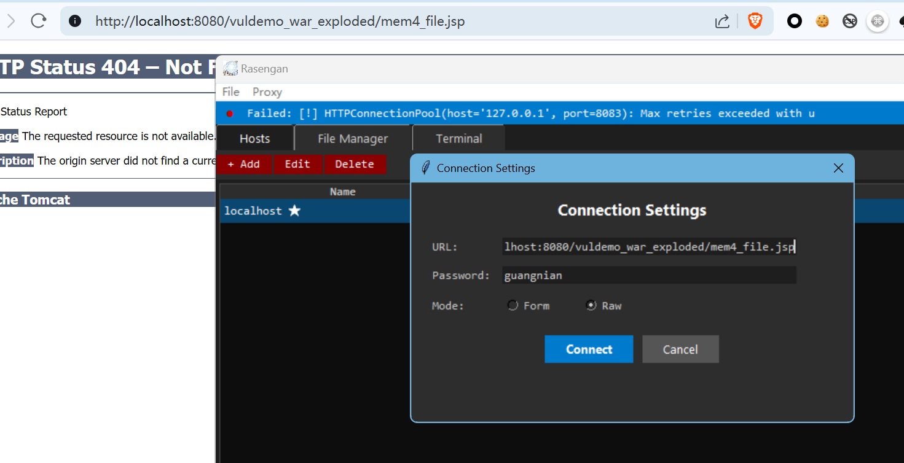
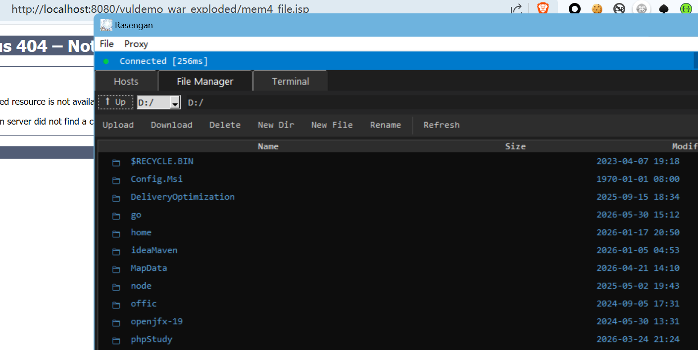
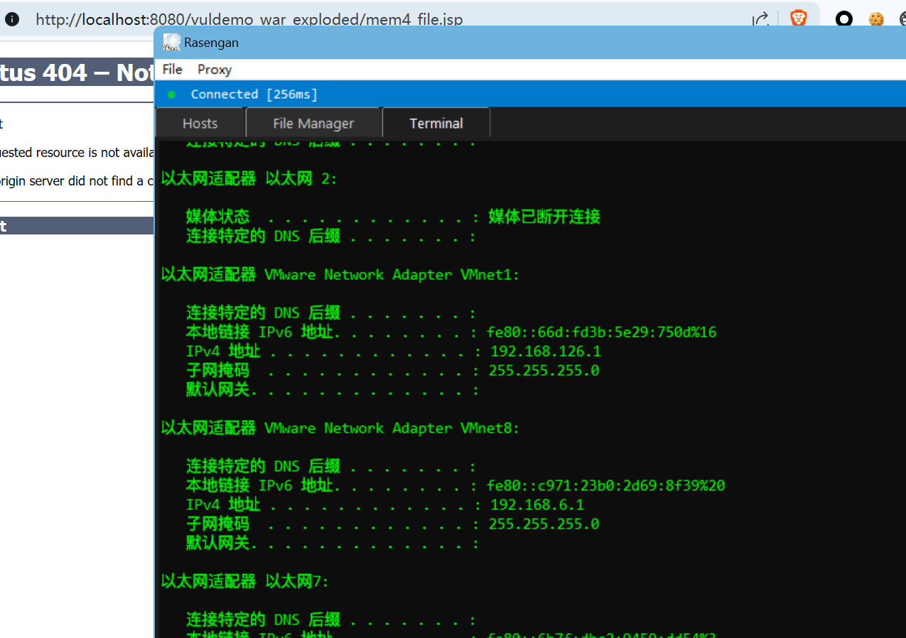

# Rasengan — Nashorn 内存马 GUI 管理工具

Rasengan (螺旋丸)是一款跨平台的 GUI 客户端，用于与基于 Java Nashorn 引擎的内存马 WebShell 进行交互。它通过 HTTP 协议提供全功能的远程文件管理器和交互式 JavaScript 终端，使对远程 Java 应用服务器的后渗透文件操作和命令执行变得快速直观。

## 功能特性

- **多主机管理** — 保存并管理多个目标连接，支持自定义名称、URL 和密码，双击即可切换主机。
- **远程文件管理器** — 通过树状视图浏览、上传、下载、删除、重命名、新建远程服务器上的文件与目录。
- **内置文本编辑器** — 双击任意远程文本文件即可在应用内打开编辑器，支持行号显示和 Ctrl+S 保存回传。
- **交互式 JS 终端** — 直接向远程 JVM 发送任意 Nashorn JavaScript 代码执行。内置 CLI 快捷指令：
    - `exec("命令")` — 通过 `Runtime.getRuntime().exec()` 执行系统命令
    - `ls("路径")`、`cat("路径")` — 列出/读取文件内容
    - `env("变量名")`、`sysprop("属性名")` — 读取环境变量和 Java 系统属性
    - 直接输入纯文本（如 `whoami`、`ipconfig`）自动包装为 `exec()` 执行
- **代理支持** — 支持通过 HTTP、HTTPS、SOCKS5 代理转发流量，可选代理认证。
- **配置持久化** — 连接设置和代理配置以 JSON 格式本地保存。
- **暗色主题界面** — 基于 Tkinter 的现代暗色 GUI，支持盘符下拉选择、文件列表按列排序。

## 工作原理

Rasengan 通过 HTTP POST 请求与远程 Java Servlet 后门（内存马）通信。目标服务器上的嵌入式 Nashorn JavaScript 引擎接收并执行 JS payload；所有 payload 经 Base64 编码后以表单数据（或原始 body）方式传输。此客户端在此信道之上提供了一个便捷的本地 GUI，用于文件管理、命令执行和交互式脚本编写。

## 工具演示

项目内部upload内置文件上传webshell,其中mem4_file.jsp为普通的jsp webshell,而mem4.jsp为内存马webshell上传后访问注入完会自动删除(注入路径/mem4).tomcat文件夹内部则内置用于进行jndi或者rmi注入的tomcat内存马(注入路径"/mem4").jetty文件夹内则内置可进行jndi或者rmi注入的内存马(注入路径为"/mem5"),spring文件夹内内置可以进行jndi或者rmi注入的内存马(注入路径为"/mem2"),以上webshell密码都为guangnian.

补充:其中jetty内存马以在vulhub中的log4j2shell漏洞进行测试成功,而springboot内存马则在vulhub中的fastjson注入中测试成功







## 环境要求

- Python 3.6+
- `requests` 库
- `tkinter`（Windows/macOS 的 Python 发行版通常自带；Linux 需安装 `python3-tk`）

```bash
pip install requests
```

## 快速开始

```bash
python Rasengan.py
```

首次启动后，点击 **⚙ Settings** 或前往 **File → Connection Settings** 配置目标 URL、密码及传输模式（Form 或 Raw）。连接信息将保存在脚本同目录下的 `nashorn_config.json` 中。

## 免责声明

本工具**仅限授权的安全测试、红队演练及教育用途**。未经授权访问计算机系统属于违法行为，作者不承担任何滥用责任。
